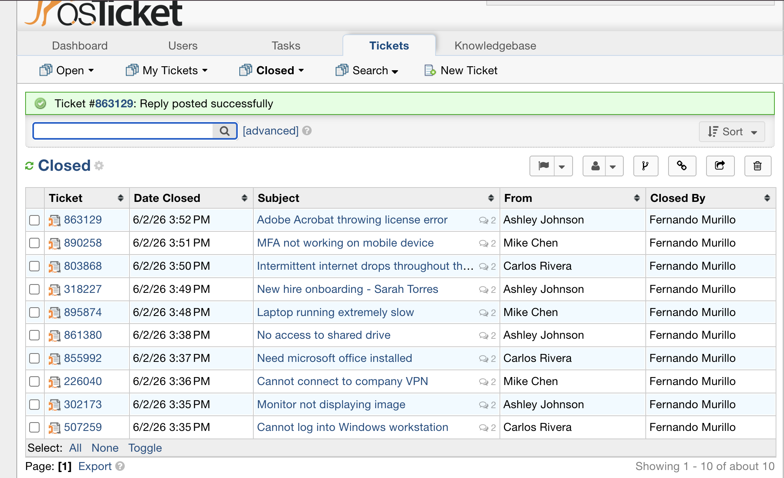
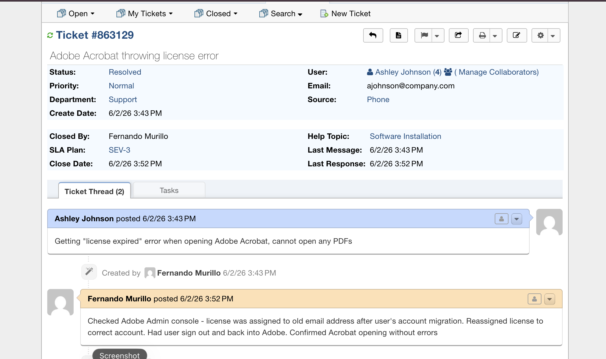
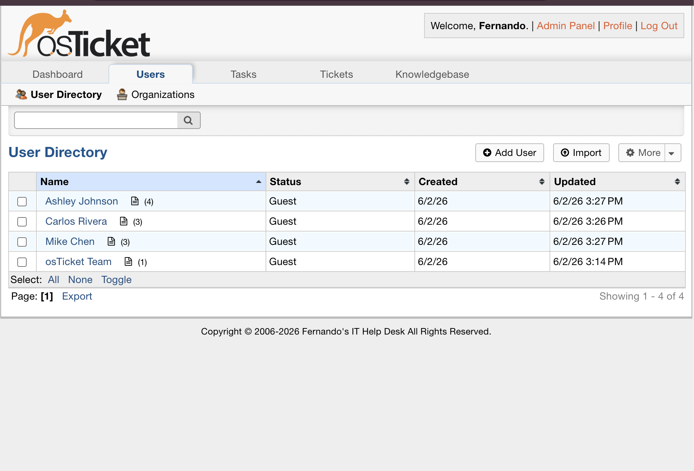

# osTicket Help Desk Lab

A fully deployed IT help desk ticketing system built on Ubuntu Server 24.04, simulating real-world enterprise IT support workflows. This lab demonstrates hands-on experience with ticket lifecycle management, SLA enforcement, department routing, and end-user support documentation.

---

## 🖥️ Environment

| Component | Details |
|---|---|
| **OS** | Ubuntu Server 24.04 LTS |
| **Web Server** | Apache 2.4 |
| **Database** | MySQL 8.0 |
| **Application** | osTicket v1.18.1 |
| **Virtualization** | Parallels Desktop (Apple Silicon) |
| **Host Machine** | MacBook Pro (ARM64) |

---

## 🎯 Objectives

- Deploy and configure a production-style helpdesk ticketing system from scratch
- Simulate real IT support workflows including ticket intake, triage, escalation, and resolution
- Practice SLA management and department-based ticket routing
- Document troubleshooting procedures following structured helpdesk workflows
- Build a reusable knowledge base of common IT support resolutions

---

## ⚙️ Installation & Configuration

### Stack Deployed
- Ubuntu Server 24.04 VM provisioned with 4GB RAM and 25GB disk
- LAMP stack installed (Apache, MySQL, PHP 8.3 + required extensions)
- osTicket v1.18.1 downloaded, extracted, and configured
- Apache virtual host configured with mod_rewrite enabled
- MySQL database and dedicated user created with least-privilege access
- Post-install hardening: setup directory removed, config file permissions locked to 0644

---

## 🏗️ Help Desk Structure

### Departments
| Department | Purpose |
|---|---|
| IT Support | General hardware, software, and account issues |
| Network Operations | Connectivity, VPN, and infrastructure issues |
| Security | Access control, MFA, and security incidents |

### Help Topics (Ticket Categories)
- Password Reset
- Hardware Issue
- Software Installation
- Network Connectivity
- Account Access
- New Employee Setup

### SLA Plans
| Plan | Response Time | Schedule |
|---|---|---|
| SEV-1 | 1 Hour | 24/7 |
| SEV-2 | 4 Hours | 24/7 |
| SEV-3 | 8 Hours | Business Hours |

---

## 🎫 Ticket Simulations

Resolved 10 simulated support tickets across all departments and SLA tiers, documenting each resolution with internal notes following structured helpdesk procedures.

### Sample Tickets & Resolutions

| # | Issue | Category | SLA | Resolution |
|---|---|---|---|---|
| 1 | User locked out of Windows workstation | Password Reset | SEV-2 | Verified identity, unlocked AD account, reset password |
| 2 | Second monitor not displaying image | Hardware Issue | SEV-2 | Re-enabled monitor via Display Settings after Windows update disabled it |
| 3 | Cannot connect to company VPN | Network Connectivity | SEV-1 | Reset expired MFA token, re-enrolled user in authenticator |
| 4 | Microsoft Office not installed on new laptop | Software Installation | SEV-3 | Deployed Office 365 via MDM, verified activation |
| 5 | No access to shared drive after department transfer | Account Access | SEV-2 | Re-added user to correct AD security group |
| 6 | Laptop extremely slow, 10+ min boot time | Hardware Issue | SEV-2 | Disabled startup programs, ran disk cleanup, verified no malware |
| 7 | New employee onboarding — Sarah Torres | New Employee Setup | SEV-1 | Created AD account, imaged laptop, installed software, configured MFA |
| 8 | Intermittent internet drops every 30-45 min | Network Connectivity | SEV-2 | Resolved DHCP lease conflict, set static reservation, escalated to NetOps |
| 9 | MFA authenticator showing invalid codes | Account Access | SEV-2 | Synced device time, re-synced authenticator tokens |
| 10 | Adobe Acrobat throwing license error | Software Installation | SEV-3 | Reassigned license in Adobe Admin Console to correct account |

---

## 📸 Screenshots

### Dashboard Overview


### Ticket Queue


### Ticket Detail & Resolution


### Departments


### Help Topics


### SLA Plans


### User Directory


---

## 💡 Skills Demonstrated

- **IT Help Desk Operations** — ticket intake, triage, escalation, and resolution
- **SLA Management** — enforcing response time policies across severity tiers
- **Active Directory Integration** — password resets, account unlocks, group management, onboarding/offboarding
- **Linux Server Administration** — Ubuntu Server setup, Apache configuration, MySQL administration
- **Documentation** — structured internal notes and resolution procedures for every ticket
- **Network Troubleshooting** — VPN, DHCP, DNS, and connectivity issue resolution
- **Endpoint Support** — Windows workstation troubleshooting, software deployment, hardware diagnostics

---

## 📋 Resume Bullets Generated From This Lab

```
IT Ticketing System Lab (osTicket)
- Deployed osTicket v1.18.1 helpdesk platform on Ubuntu Server 24.04 within a 
  virtualized environment, configuring Apache, MySQL, and PHP from scratch
- Configured ticket departments, SLA policies (SEV-1/2/3), and help topic routing 
  to simulate enterprise IT support workflows
- Created and resolved 10+ support tickets across categories including password resets, 
  hardware faults, software deployments, VPN issues, and employee onboarding
- Documented all resolutions with structured internal notes following professional 
  helpdesk procedures
```

---

## 🔗 Related Projects

- [Active Directory Home Lab](https://github.com/FernandoMurillo1/Active-Directory-)
- [Wazuh SIEM Lab](https://github.com/FernandoMurillo1/Wazuh-SIEM-Lab)

---

*Part of an ongoing IT homelab portfolio demonstrating hands-on experience in help desk operations, system administration, and cybersecurity.*# osTicket-Help-Desk-Lab
